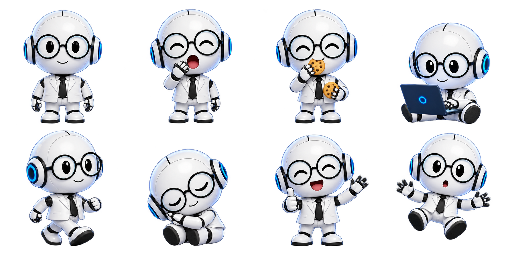

# 赛博老爸桌宠

v0.6.0 新增 `cyberdad` 预设。根据项目方提供的赛博老爸 VI，把珍珠白圆头、黑色圆框眼镜、蓝青耳机、白西装和黑领带做成约两头身的全身小伙伴。它与已移除的旧 `robot` 预设不同；鲸鱼娘、小蓝鲸、奶油猫和自定义宠物继续保留，默认仍是鲸鱼娘。

## 使用与互动

在原生 **设置 → 美化工具箱 → 桌面宠物** 选择「赛博老爸」并应用；已经显示桌宠时，也可以在本体右键菜单切换。

完成依赖安装后，独立运行命令为：

```sh
./run.sh pet
```

这不会启动 Harness 后端。新版代码不会自动替换已运行的桌宠进程；更新后先右键「退出桌宠」，再运行上述命令。隐藏、暂停和退出是不同操作。

- **右键 → 陪陪赛博老爸**：吃块饼干、陪我工作、打个哈欠。
- **散散步**：迈着小短腿来回走动与转身，动作限制在原来的透明窗口里，不改保存的位置。
- **单击**：挥手、点赞等回应；睡着时先唤醒。快速连点三次可跳跃或转圈，拖动时显示被提起的姿势，松手后落地。
- **待机**：45 秒未与桌宠互动会犯困，120 秒会睡觉。不读取其他应用中的键盘输入。
- **大小**：右键可选 80、100、120、180、240 px，管理页可在 80–320 px 间细调；大小和拖拽位置保存在本地。
- **声音**：真实点击播放短促的本地合成轻音，不需要网络或 API Key。可从右键「点击音效」或管理页静音；自动动作与菜单操作不主动发声。
- **暂停或退出**：暂停冻结动画和闲置计时；隐藏后可从菜单栏 `◉` 重新显示；退出会关闭桌宠伴随进程，不退出原生 Harness。

完整行为、录屏步骤和尺寸说明见 [桌宠互动](桌宠互动.md)。

## 素材与动作实现

| 格子（从 0 开始） | 姿势 | 用途 |
| --- | --- | --- |
| 0 | 正面站立 | 待机、轻微呼吸 |
| 1 | 张嘴打哈欠 | 困倦或手动哈欠 |
| 2 | 吃饼干 | 零食动作，约 4 秒 |
| 3 | 电脑工作 | 工作动作，约 5 秒 |
| 4 | 迈步 | 来回走动与转身，约 6 秒 |
| 5 | 闭眼睡眠 | 闲置睡眠或「打个盹」 |
| 6 | 挥手点赞 | 点击、开心与唤醒反馈 |
| 7 | 被提起 | 拖拽反馈 |

素材为 `assets/cyberdad-atlas.png`，1774×887 RGBA PNG，四列两行、八个等分方格。程序选择当前姿势，再加 CSS 位移、呼吸、摇摆等动作；**这是姿势切换与图形运动，不是完整逐帧或骨骼动画**。它与鲸鱼娘复用同一图集渲染器、桌面窗口、大小调节和透明度命中机制。

下图是实际使用的姿势图集：



替换时保持格子顺序与安全透明留白，细节见 [素材替换](素材替换.md#替换赛博老爸桌宠)。

## 来源与生成记录

用户提供的 `542DAB0E-0C00-4243-A700-96D2C968703A 2.PNG`（赛博老爸 VI 标准三视图）是角色依据；现有 `assets/cyberdad-logo.png` 用于保持品牌一致。通过内置 `image_gen` 生成透明全身图集，直接采用工具输出，没有用程序重绘或抠图。无需申请外部 API Key。

SHA-256：`8c175f2696398a3390f147dfa2cae6db16c730966fb3b57b5c4c871c438bc7ec`。

角色与品牌由项目方提供，代码的 MIT 许可不授予额外的品牌名称、形象或商标权利，见 [来源声明](../THIRD_PARTY_NOTICES.md)。生成提示词要求理想尺寸 2048×1024；工具实际输出为上文的 1774×887，仍保持准确的 2:1 比例，由渲染器等分读取。

<details>
<summary>完整生成提示词</summary>

```text
Use case: stylized-concept. Asset type: production transparent desktop-pet sprite atlas for the CyberDad / 赛博老爸 brand.
Input 1 is the authoritative character VI design reference. Input 2 is the matching brand bust logo. Create a NEW full-body super-cute chibi adaptation of this exact character, NOT a sheet of logos. Preserve pearl-white ROUND head, big BLACK ROUND eyeglasses, black oval expressive eyes, circular white over-ear headphones with blue/cyan luminous rings, white formal jacket and trousers, black tie, black small joints, white rounded shoes. NO antenna, no rectangular head. Friendly fatherly warmth, premium soft glossy 3D toy rendering, clean contours, restrained blue highlights. About 2 heads tall with delightfully tiny body and feet; identical character proportions, scale, camera, lighting, white suit, glasses, and headphones in every cell. Hands/paws must be anatomically distinct and readable; two arms and two legs.
Canvas: EXACT 2:1 aspect ratio, ideally 2048 x 1024. A precisely aligned 4-column by 2-row grid of EIGHT equal SQUARE 512x512 cells. No visible grid. Row-major order. Each character including props entirely within its own cell, centered at cell x=50%, feet/lowest content around y=85%; at least 12% transparent padding on EVERY side. Head size identical across poses. No element overlaps any cell boundary. Real transparent alpha everywhere outside character/prop, not white, no checkerboard, no colored backdrop, no floor, no drop-shadow ellipse. No text, no labels, no letters, no watermarks.
Cell 0 top-left: idle full-body standing front-on, both hands visible by the body, gentle smile, eyes open.
Cell 1 top-second: adorable wide-open-mouth YAWN, eyes squeezed into sleepy curves behind glasses, one hand politely beside the open mouth, other relaxed by side; full body.
Cell 2 top-third: happily EATING a small round golden cookie held near mouth in one hand, other hand holding another cookie at waist, both arms clear, eyes delighted; full body.
Cell 3 top-right: WORKING, seated on the ground behind a small open navy blue laptop, both hands at keyboard, curious focused eyes; entire character and laptop fit within cell.
Cell 4 bottom-left: WALKING in a cute three-quarter view facing right, one little leg forward and other back clearly separated, arms counter-swinging, friendly smile.
Cell 5 bottom-second: SLEEPING curled seated on the ground, round head tilted resting on two hands, closed eyes visible inside glasses, legs tucked in, no bed/pillow, tiny peaceful mouth.
Cell 6 bottom-third: HAPPY CLICK response, one arm waving, other hand gives a thumbs-up, laughing eyes, delighted smile; two feet planted, full body.
Cell 7 bottom-right: PICKED-UP / DRAGGING reaction, whole body lifted slightly with both little legs dangling apart and arms spread, surprised small O mouth and large eyes; no human hand or string.
This is a functional atlas to be split into equal square cells by code. Prioritize precise regular placement and generous transparent gutters while making a polished cute coherent brand pet.
```

</details>

## 验证与运行截图

从仓库目录运行专用的隔离桌宠验证：

```sh
./run.sh test:cyberdad-pet
```

脚本使用临时设置与独立测试进程，不修改日常桌宠的选择、尺寸或位置。实际通过情况、实机验收范围和未验证项统一记录在 [验证报告](验证报告.md)。

八种姿势的独立窗口截图：

[站立](screenshots/cyberdad-idle.png) · [哈欠](screenshots/cyberdad-yawn.png) · [吃饼干](screenshots/cyberdad-eat.png) · [工作](screenshots/cyberdad-work.png) · [走路](screenshots/cyberdad-walk.png) · [睡眠](screenshots/cyberdad-sleep.png) · [挥手点赞](screenshots/cyberdad-wave.png) · [拖拽](screenshots/cyberdad-drag.png)
