# 原生插件实际验证报告

初次验证：2026-10-04；自定义与桌宠互动补充验证：2026-10-05；鲸鱼娘与赛博老爸补充验证：2026-10-06（工具箱最新 0.8.2）。macOS 26.6.2 / Apple Silicon / Node 24.19.0。原生应用 `/Applications/DeepSeek Harness.app` 为 **0.2.0-rc.2**，对照上游 `dsh-v0.2.0-rc.2`、commit `639ed015397290b3745d163aafe02ffee4aa3f84`。桌宠 Electron 44.0.0。

本报告只记录最终的**原生插件版本**，前一版独立聊天壳的测试与截图不作为本版验收依据。

## GitHub 发布准备（2026-10-06，v0.8.2）

目标公开仓库为 [cyberdaddyleo/deepseek-meihuaqi](https://github.com/cyberdaddyleo/deepseek-meihuaqi)。以不含 `.local/`、`.runtime/`、`node_modules/` 或个人 profile 的独立发布副本运行 `./run.sh setup`：使用本机已有、带头文件的 Node 24.19.0，锁定依赖安装与构建成功；没有重复下载 Node 运行时。发布副本的 `./run.sh test` 为 66/66 通过，`shasum -a 256 -c assets/SHA256SUMS` 的 24 个素材全部一致。

已核对六个启动画面、六套界面皮肤、四个桌宠及三个视频的本地媒体路径，保留代码、来源材料、许可证、替换说明与测试脚本。源码不包含运行缓存、私有配置或安装备份。候选文本检查未发现常见密钥、私钥或个人绝对路径；80 张历史运行截图逐张视觉检查，账号区域已遮挡，展示内容为测试用例。未以 OCR 结果作为证据。

README 与 AI 部署提示词使用真实仓库地址；根目录 `AGENTS.md` 提供 AI 部署入口，安装与启动分别明确列出。此轮为发布整理和干净依赖验证，没有向当前用户 profile 再次安装插件，也没有重跑全部原生 UI／桌宠交互；实际运行证据及边界沿用下方逐版本记录。

## 0.8.2 启动页小图标与无文案画面

视频右下角的声音、跳过按钮改为 30×30 px 半透明圆角小按钮和 16×16 px 线条 SVG，去掉按钮可见文字、左下方的就绪／初始化说明及原来的底部渐变遮罩。声音图标随静音状态改变；SVG 与自定义图片启动页共用小跳过按钮。保留读屏名称、Tab／Enter／Esc、完整视频播放、真实加载与错误恢复逻辑。管理页视频预览的原生播放控件保持不变，没有修改视频或音轨。

| 检查 | 本次实际结果 |
| --- | --- |
| 构建与单元 | `./run.sh build` 成功，`./run.sh test` 66/66 通过，无新增依赖 |
| SVG 与鲸鱼娘回归 | `./run.sh test:startup` 通过：5 个 SVG／自定义分支及 21 个鲸鱼娘视频检查；覆盖尺寸、SVG、空按钮文字、无就绪文案、静音切换、键盘、完整播放、失败与资源释放 |
| 极客视频回归 | `./run.sh test:geek-video` 21 个检查通过；真实音频采样 peak=0.515065、RMS=0.073719；7.071995 秒完整结束，原音轨与图标切换正常 |
| 原生冷启动 | 使用用户当前选中的赛博老爸片头；首次采样 0.749047 秒、1918×1080，采样 150 帧至第 7 秒；真实 ended=7.071995 秒，约 189.6 ms 后清源并进入真实原生编辑器 |
| 原生图标与声音 | 两个按钮均为 30×30 px、包含 SVG、无可见文字；footer 文本为空、状态提示节点为 0；真实点击关声／开声后，静音属性与图标一致。结束时未静音、volume=1、解码音轨 114057 字节 |
| 实际画面 | 检查下方原生冷启动截图，右下角仅有两个小图标，左下方没有插件提示文案；画面内原片自带的文字保持不变 |

原生冷启动验证位于 `dsh-app://app/`，使用仓库 Playwright 与临时本地 CDP；鲸鱼娘和极客的本轮视频用例为隔离渲染测试，不冒充当前原生所选片头。未更改三类预设选择、AI 配置、桌宠尺寸或位置，没有发送模型请求。未重测其他操作系统、触屏尺寸或人工扬声器听感；原生加载失败分支由隔离测试覆盖。测试结束后正常关闭临时实例，以 `./run.sh start` 日常方式重新打开；确认真实原生编辑器可见、临时 9224 端口已关闭且主进程不带调试参数。

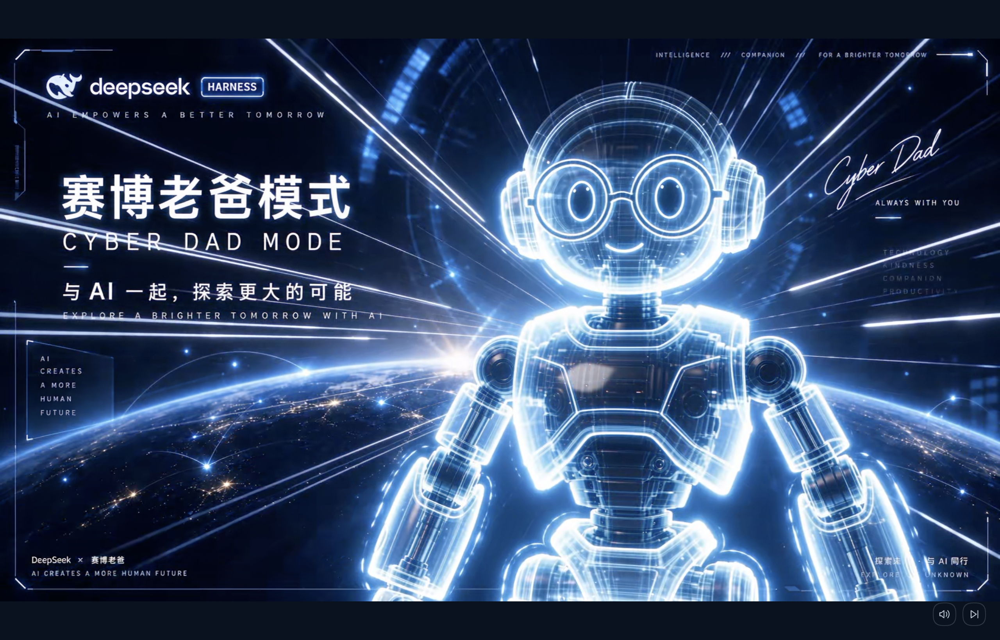

## 0.8.1 极客代码与终端装饰

新增官方 `shell.overlay` 列表入口中的静态 HUD：场景代码、灵感序列、创意脚本，带行号、语法配色、细线框、青蓝标题栏及红色角标。使用 CSS anchor 跟随原生主区、标题与输入框；没有搬动编辑器，没有新增轮询、动画循环或业务接口。真实代码块、终端和工具卡通过上游稳定样式钩子增加相同风格，管理卡片共用场景代码片段。

本机仍为 macOS Apple Silicon / 原生 Harness 0.2.0-rc.2。Browser plugin not available；使用仓库 Playwright 接入临时本机 CDP `127.0.0.1:9224`，并使用原生应用控制正常退出。目标流程为：原生空白首页 → 极客装饰 → 输入/切主题/缩窄/收起侧栏/进入设置 → 真实编辑器保持可用。

| 检查 | 本次实际结果 |
| --- | --- |
| 构建和回归 | `./run.sh build` 成功；`./run.sh test` 66/66通过；`./run.sh test:custom-manager`通过 |
| 原生专项 | `./run.sh test:geek-hud`通过，页面为 `dsh-app://app/`，真实首页、菜单和设置正常，无渲染页面错误；新增装饰没有出现在设置背景上 |
| 位置与点击 | 1280×820视口三块面板可见；主区域和装饰左边界误差0px；逐卡检查均在主区内且不与标题/输入框重叠；命中测试均穿透至下层，`aria-hidden=true`、`inert=true`、`pointer-events=none` |
| 草稿和收起 | 森林/极客及美化开关来回切换，仍是同一个输入节点，草稿保持；20行草稿时可用空间不足，整块代码卡收起；恢复空输入后重新显示 |
| 尺寸变化 | 900×720视口中装饰收起、输入可用；收起/打开原生侧边栏时，装饰跟随主区域，无需JS测量或轮询 |
| 会话状态 | 在真实原生容器上做`data-content-phase=active`的临时CSS状态夹具，装饰隐藏，随即恢复；此项是样式状态验证，不冒充实际AI会话执行 |
| 管理预览 | 场景代码与实际皮肤共用数据；最终缩略卡标题6px、三行代码没有横向截断，输入框预览保留；原生设置截图已保存 |
| 既有素材 | 本轮未改极客视频或音轨，SHA-256仍为`a14d054783a89e9514c94ca9fb89da0211540fd2c1eebe8fb5cac5df868b785c`；声音与完整启动验证沿用0.8.0记录 |

与参考图的差别：保留原生布局及真实功能，增加独立的装饰代码排版；没有添加参考图中的虚构CPU占用、联网状态、模型指标或日志。首页装饰在会话中隐藏，实际代码块与工具卡自身保留终端样式。

本轮没有发送模型请求，未重新验收真实任务中的代码复制、工具执行、所有右侧栏组合、字体缩放或其他操作系统。代码/终端/工具卡选择器已对照本地上游源文件核对，语法和真实状态颜色、复制/滚动/展开逻辑没有修改。所有测试草稿、主题开关和侧栏状态均恢复；普通启动不保留调试端口。

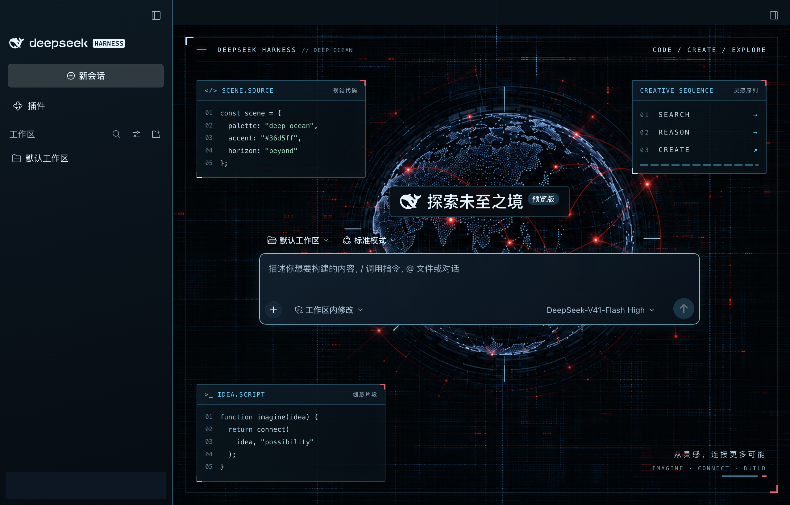
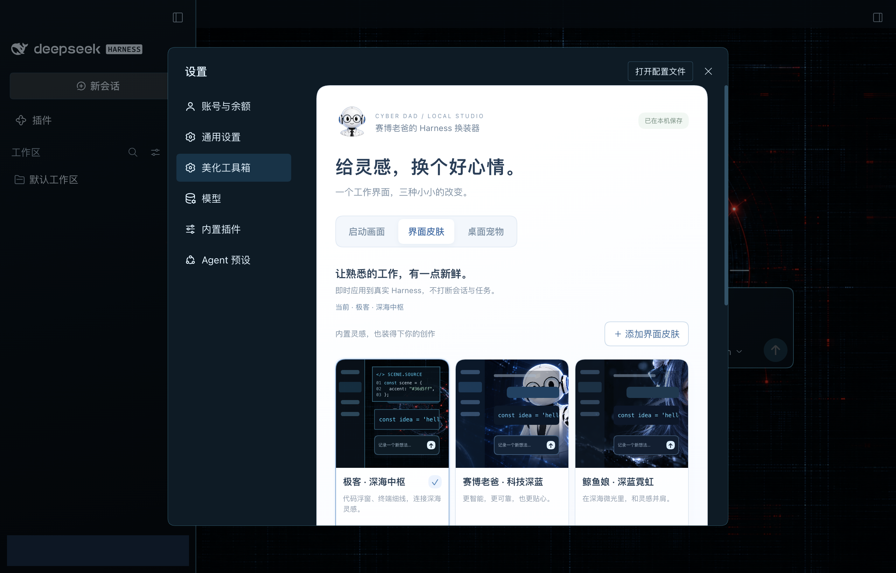
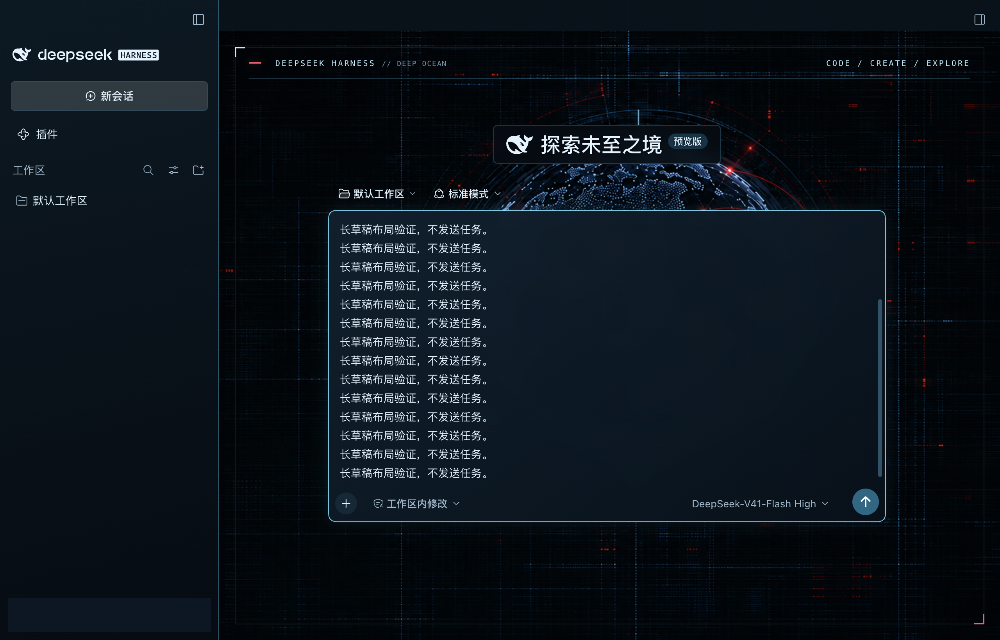
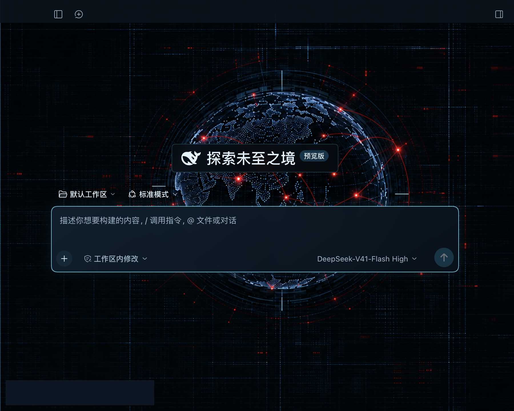

## 0.8.0 极客启动与真实皮肤

新增「极客 · 系统唤醒」及「极客 · 深海中枢」，各自独立保存，首次默认仍为鲸鱼娘。用户原视频完整保留；皮肤背景由参考图去除静态控件、日志和数字，使用真实原生组件与设计令牌呈现界面。原片画面里的 HUD 文字属于装饰视频，不作为真实任务或系统指标。

| 检查 | 本次实际结果 |
| --- | --- |
| 构建与单元 | `./run.sh build` 成功，`./run.sh test` 66/66通过；新增独立组合、样式标记清理、精确媒体白名单和实际文字/背景令牌对比度检查，无新增依赖 |
| 视频真实声音 | `./run.sh test:geek-video` 的20个播放场景及1个PCM波形检查通过；实际peak=0.515065、RMS=0.073719，音轨有非静音内容；默认未静音、volume=1，沿用声音按钮及自动播放受限时的静音回退 |
| 完整原生冷启动 | 正常完全退出后打开官方应用；首次采样0.944569秒、3184×1792，视频结束于7.071995秒，音轨解码114091字节；结束约192.7ms后清源，进入真实编辑器 |
| 原生完整回归 | `./run.sh test:geek-native`通过：实际playingTime=0，object-fit=contain，未静音，结束约186.6ms后释放Blob；同一输入框和草稿在森林/鲸鱼娘/极客间切换后保持，原生菜单、管理页、视频预览和关闭/开启美化正常，无页面错误 |
| 真实皮肤 | 读回根背景#050c12、真实geek-wallpaper媒体地址及实际输入框深蓝渐变；实际首页、菜单、设置截图检查通过。背景为静态PNG，没有新增动画循环；原生语义状态和代码语法颜色沿用上游暗色体系 |
| 管理页回归 | `./run.sh test:custom-manager`通过：预览、尺寸控制、自定义导入/删除和素材失败回退正常；新卡片与旧分类一起显示 |
| 运行设置 | 当前已应用极客启动与皮肤，保留赛博老爸桌宠、120px和原位置；旧桌宠伴随进程正常退出后从新代码重新启动，防止缓存的旧目录把新ID回退为默认 |

本次仍使用 macOS Apple Silicon、Harness 0.2.0-rc.2。没有 Browser 插件，采用仓库 Playwright 与原生系统应用控制；测试后关闭临时调试实例，再以 `./run.sh start` 正常打开。新截图遮盖账号入口。未发送模型请求，也未重跑历史AI任务、跨应用桌宠物理交互或人工扬声器试听；其他系统未验证。依赖安装沿用历史记录，本轮没有重复下载依赖。

参考与生成背景及完整提示词见[极客主题](极客主题.md)。视觉稿里的额外仪表、日志和模型功能未作为新业务实现；最终界面保持原生结构。

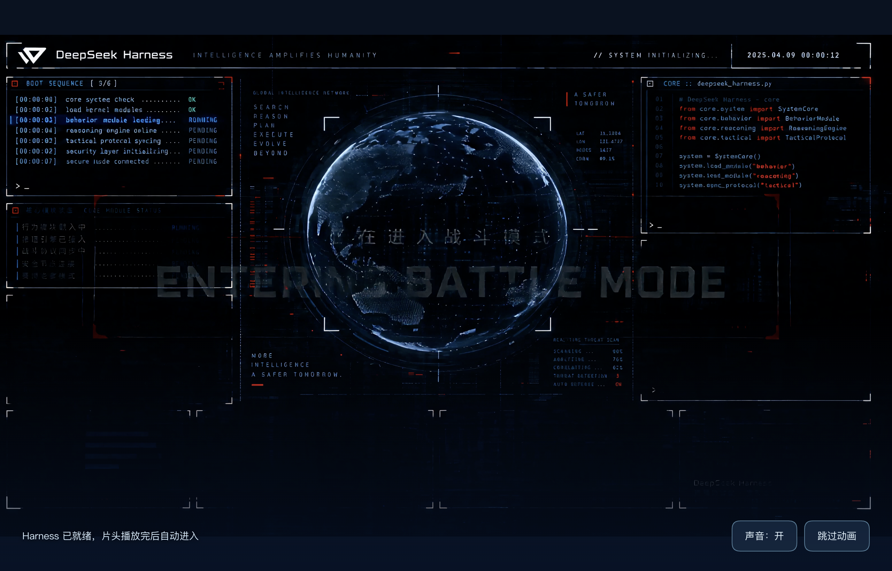
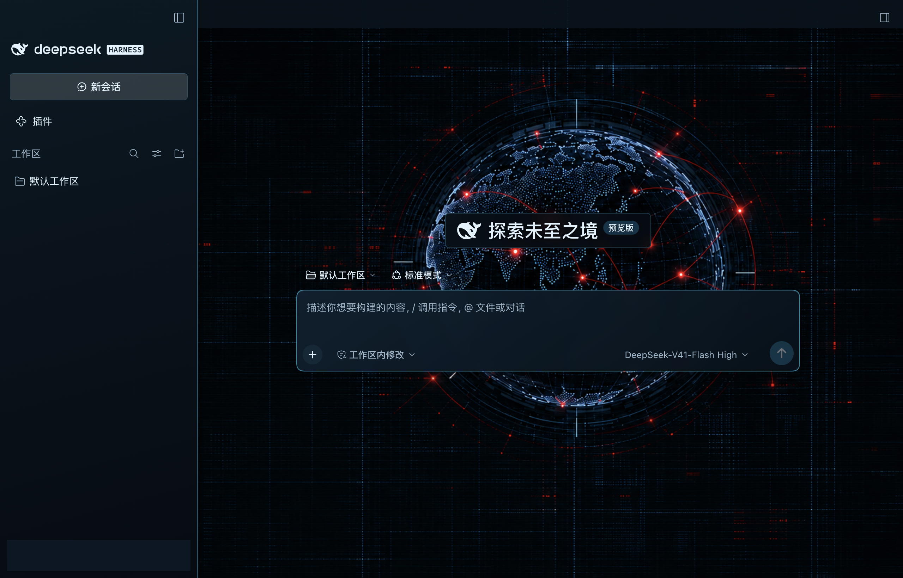
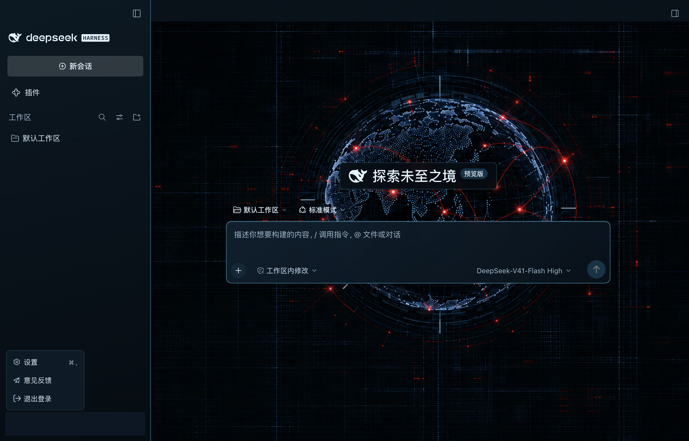

## 0.7.2 鲸鱼娘新音轨（历史记录）

用户补充的视频提供了实际声音。旧鲸鱼娘素材虽有 AAC 音轨，但音频采样全为静音，因此 0.7.1 的「未静音、音量非零、音轨已解码」检查不能证明素材有可听内容。本轮增加真正的 PCM 波形能量检查，并用新声音替换静音轨。

| 检查 | 本次实际结果 |
| --- | --- |
| 原片画面保持 | 最终文件与原720p文件的全部211个H.264视频数据包哈希、PTS、DTS和帧时长完全一致；画面未重编码，1280×720，总时长仍7.081995秒 |
| 新音轨处理 | 用户新4K视频只提取音轨，转为AAC-LC/44.1kHz/双声道；降低6dB，15ms淡入、源末120ms淡出并补齐尾部。源文件、命令和SHA记录在[音轨说明](鲸鱼娘启动音轨.md) |
| 非静音实际采样 | Chromium通过正式媒体处理函数取得运行MP4后解码PCM：peak=0.640672、RMS=0.185608，末50ms RMS约0.00000157；波形有实际声音且尾部平顺，不再仅用解码字节数验收 |
| 原生媒体来源 | 在真实 `dsh-app://app/` 经鉴权媒体路由读取文件，SHA与交付MP4一致；原生OfflineAudioContext读出的非静音波形能量与隔离测试一致 |
| 原生冷启动 | 首次采样currentTime=0.46935秒、未静音、volume=1；最终真实endedTime=7.081995秒、音轨解码149171字节；约184.5ms后清源进入真实编辑器 |
| 原生回归与预览 | `test:whalegirl-native` 通过：实际playingTime=0，预览未静音、volume=1，音轨持续解码；同一输入框/草稿、菜单、主题与工具箱正常，无页面错误。回归暂用鲸鱼娘皮肤，结束后恢复原赛博老爸皮肤并确认桌宠设置未变 |
| 回归 | 构建成功，62/62单元通过；`./run.sh test:video-startup` 的20个播放场景及新增1个非静音波形检查通过，覆盖声音开关、自动播放回退、完整播放、跳过、隐藏恢复和资源释放 |

本次沿用现有播放器与媒体接口，没有新增运行依赖或改动赛博老爸声音。FFmpeg仅用于准备仓库素材；用户安装和播放不需要安装FFmpeg。当前Mac实际启动使用鲸鱼娘片头，原有赛博老爸皮肤、桌宠、120px尺寸与位置保留。没有发送模型请求、改系统音量或人工评价扬声器听感；其他操作系统未验证。

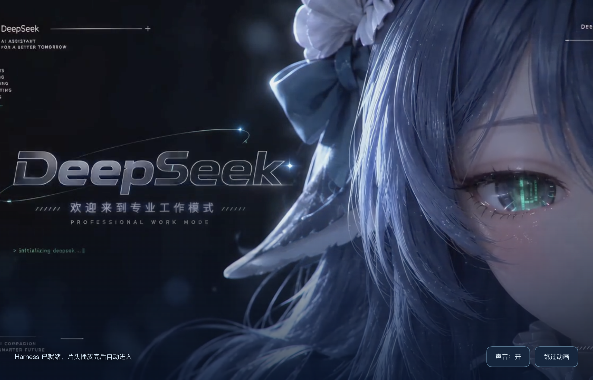

## 0.7.1 启动视频原声（历史记录）

根因是启动元素同时写死了 `muted=true`、`defaultMuted=true`、`volume=0`；管理页预览也强制静音。两段原片均有 AAC 双声道、44.1kHz 音轨，素材无需转码。本次启用原声与 `volume=1`，启动层增加仅对本次播放生效的声音开关；预览使用原生视频音量控件。

| 检查 | 本次实际结果 |
| --- | --- |
| 构建与单元回归 | `./run.sh build` 成功，`./run.sh test` 62/62 通过，无新增依赖 |
| 原生有声冷启动 | 正常退出后启动官方应用，首次采样 currentTime=0.499512、muted=false、volume=1、已解码音轨 14,336 字节；真实结束时间 7.071995 秒，音轨解码累计 114,057 字节，结束约 187.1ms 后清源并进入真实编辑器 |
| 原生启动与预览 | `./run.sh test:cyberdad-native` 通过：真实 playingTime=0，音轨解码 114,057 字节且未静音；预览亦未静音、volume=1，采样已解码 12,491 字节。真实菜单、主题、同一输入框及草稿、工具箱和美化开关回归通过，无页面错误 |
| 两段原片完整回归 | `test:cyberdad-video` 与 `test:video-startup` 分别 20 个场景通过；完整路径到达真实 ended，启用原声音轨，原有跳过、错误、加载超时与 Blob 释放正常 |
| 声音交互 | 模拟策略拒绝有声播放后，实际视频静音继续；可信点击恢复声音，开关声音不重播片头。Tab/Shift+Tab 可在声音与跳过按钮间切换，Enter 可开声，焦点不进入被遮挡编辑器 |
| 暂停与清理 | 实际启动层隐藏时音视频一起暂停，恢复后继续；跳过、自然结束和离开均暂停、清除源、停止解码并释放 Blob。无法静音播放时仍走既有媒体失败回退 |

实际原生冷启动未使用放宽自动播放策略的启动参数，也未改动签名应用。隔离 Chromium 主流程显式采用 Electron 默认自动播放策略，受限策略另用拒绝分支验证。当前无 Browser 插件，使用仓库 Playwright 与原生应用控制。

音频证据为真实原片音轨解码、播放进度、未静音及非零播放器音量；没有人工扬声器试听或改变系统音量、输出设备。其他系统未验证；依赖安装沿用原有记录，本次未重复干净安装。预览若受自动播放限制，需点击其原生播放按钮；预览不承诺启动层的自动静音重试和隐藏暂停。

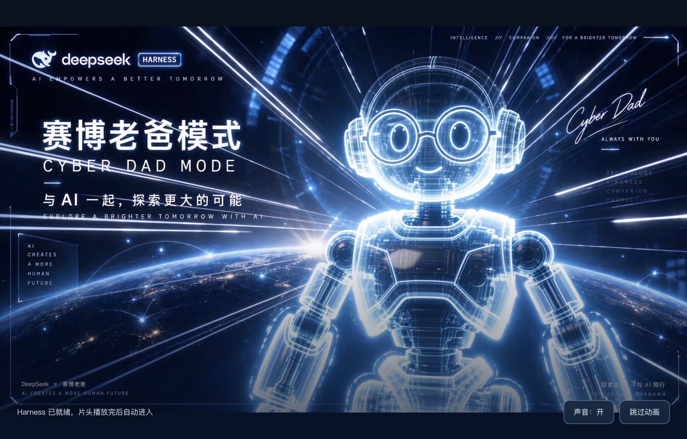

## 0.7.0 赛博老爸启动画面与原生皮肤（历史记录）

新增独立的「赛博老爸 · 蓝光启程」与「赛博老爸 · 科技深蓝」。视频原样保存；界面参考先移除画在图中的按钮、文字和输入框，再使用原生主题令牌与少量既有组件样式呈现真实界面。没有改签名安装包、账号、模型或任务逻辑。

| 检查 | 本次实际结果 |
| --- | --- |
| 构建与单元回归 | `./run.sh build` 成功；`./run.sh test` 62/62 通过，包括两种壁纸主题之间切换、普通主题及关闭美化时清理标记、令牌隔离和媒体精确白名单 |
| 实际原生冷启动 | 正常退出后重新启动官方应用；接入时已播放至 0.816091 秒，持续采样 149 帧到末帧 7.0 秒，真实 endedTime=7.071995 秒；结束约 187.5ms 后移除视频，进入真实输入界面，清除媒体源 |
| 原生回归 | `./run.sh test:cyberdad-native` 通过；实际视频 1918×1080，首个采样帧 0.05 秒，endedTime=7.071995 秒；结束约 185.1ms 后释放，Blob 创建与撤销一一对应，无渲染页面错误 |
| 完整画面与可读性 | 原生启动图层实际 `object-fit: contain`，窗口比例不同时留深蓝边，文字没有左右裁切；原生首页标题增加深蓝底板，避免与角色白色头部混在一起。检查最终实际启动与首页截图 |
| 原生皮肤与输入 | 读回根背景 `#071321`、真实壁纸资源与真实输入框深蓝渐变；森林、鲸鱼娘、赛博老爸之间切换保留同一个原生输入框与测试草稿。菜单、工具箱与主题应用状态正常；关闭/开启美化会清理/恢复本插件的壁纸标记 |
| 视频故障与旧预设回归 | `./run.sh test:cyberdad-video` 与原 `./run.sh test:video-startup` 分别通过 19 个场景；覆盖完整播放、提前就绪、显式跳过、键盘、隐藏恢复、加载故障、超时与资源释放；鲸鱼娘原有播放适配保持不变 |
| 统一管理页 | `./run.sh test:custom-manager` 通过；自定义导入、保存与既有功能正常。原生管理页的新视频可完整解码预览，三类选择保持独立 |
| 本地设置 | 当前应用已选择新启动视频与新皮肤，原有赛博老爸桌宠、120px 大小及位置保留。完全重启后选择仍生效；测试草稿恢复，不发送模型请求 |

当前环境未提供 Browser 插件；渲染验证使用仓库 Playwright 脚本和临时本地 CDP，原生应用退出与日常打开使用系统应用控制。测试后退出调试实例，用 `./run.sh start` 正常打开。测试截图来自 `dsh-app://app/`，并遮盖账号入口。

本次没有新增依赖或重复干净安装，沿用 0.5.0 安装记录；没有重跑 AI 任务，真实任务执行记录见历史章节。桌宠跨应用物理点击、显示器变化及其他系统的未验证边界保持不变。新主题用例可在空闲、无私人会话的临时调试实例执行 `./run.sh test:cyberdad-native`，启动调试实例的方法见下方「可复现测试」。


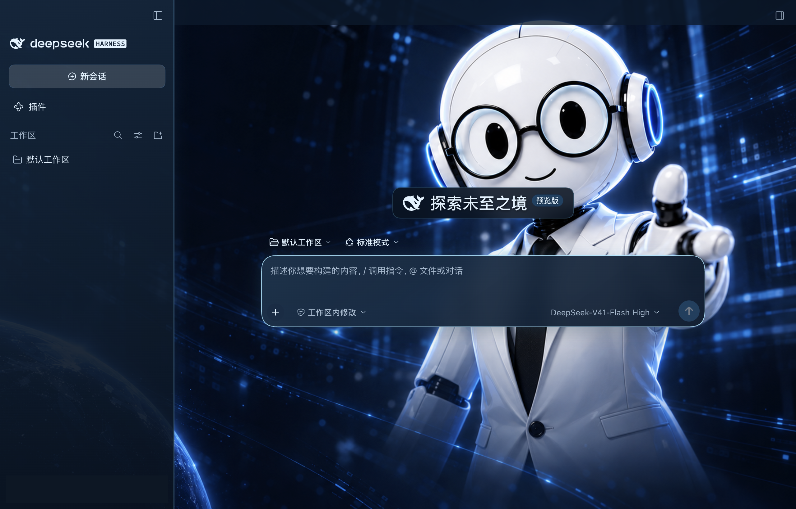
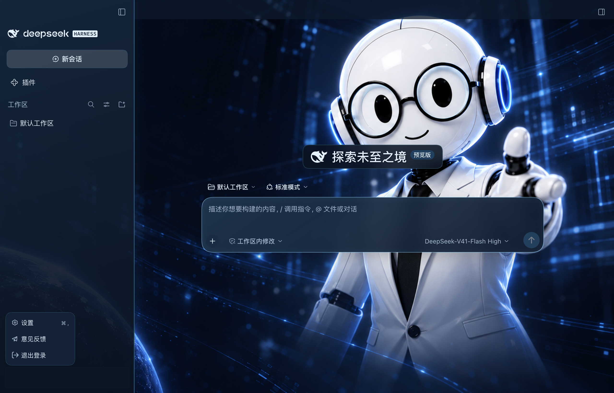
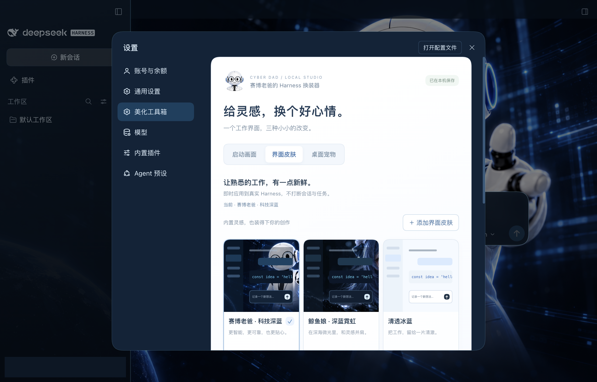

## 0.6.0 赛博老爸 VI 桌宠（历史记录）

新增独立 `cyberdad` 预设，使用根据用户 VI 生成的本地透明八姿势图集。保留圆头、圆框眼镜、蓝色耳机、白西装和黑领带；旧 `robot` 选项继续移除。新预设置于目录首项，但首次安装和损坏配置的默认选项仍为鲸鱼娘。

| 检查 | 实际结果 |
| --- | --- |
| 构建与单元回归 | `./run.sh build` 成功，`./run.sh test` 59/59 通过；无新增依赖 |
| 赛博老爸真实桌宠 | `./run.sh test:cyberdad-pet` 通过：8 种姿势像素不同，真实 Electron 透明置顶窗口不抢焦点；工作、饼干、哈欠、走动、睡眠、点击和拖拽均正常 |
| 走动与缩放 | 修正角色朝向与位移方向；左右折返后回到原位。实际切换 80、100、240、180px 后，窗口尺寸与保存值一致，实体/透明像素命中仍正确 |
| 互动与音效 | 45 秒困倦、120 秒睡眠、点击唤醒、暂停/恢复、菜单禁用、拖动保存位置、点击音效与静音通过。声音测试用真实可信点击驱动生产合成逻辑，音频节点在离线音频上下文中检查，未进行本轮人工听感评价 |
| 现有桌宠回归 | `./run.sh test:pet` 通过：原生右键与独立管理页、尺寸、位置、退出、自定义图片、损坏回退正常；修复了新增首项后无效 ID 回退随目录排序变化的问题 |
| 管理页 | `./run.sh test:custom-manager` 通过：新图集成功解码、尺寸调节、自定义内容导入/删除仍有效。卡片悬停改为移动裁切容器，避免露出相邻姿势；图集损坏时显示完整小蓝鲸回退图 |
| 当前原生应用 | 正常退出空闲 Harness 后运行 `./run.sh start` 载入新 Host 目录和资源；在 `dsh-app://app/` 的真实设置页点击应用赛博老爸，确认卡片预览、使用中状态及本地保存。保留鲸鱼娘启动视频、深蓝霓虹皮肤、180px 大小和原位置 |

桌宠进程已正常重新载入最终代码。测试使用临时设置，测试窗口均正常退出；日常桌宠继续运行。八张截图来自实际桌宠窗口，详见 [赛博老爸桌宠](赛博老爸桌宠.md)。新动作是姿态切换配合 CSS 运动，不是完整逐帧角色动画。

本轮验证透明命中信号与原生窗口配置，没有补做跨应用物理点击、显示器热插拔或其他操作系统验收。完整启动视频逻辑未改动，沿用 0.5.2 验证；依赖安装沿用 0.5.0 干净安装记录，本轮未重复下载依赖。


## 0.5.3 移除机器人桌宠、补齐猫咪双前爪（历史记录）

桌宠目录现为鲸鱼娘、小蓝鲸、奶油猫与用户自定义内容。管理页与原生右键菜单都从同一目录读取，小机器人不再出现。旧配置的 robot ID 自动回退鲸鱼娘，保留尺寸、位置、暂停、音效及其他模块选择；素材损坏回退小蓝鲸，紧急内嵌图形也不再是机器人。赛博老爸品牌 logo 保留。

奶油猫保留原有轻量 SVG 造型，新增左右独立、对称清晰的前爪轮廓与柔和肚皮；两只后脚单独保留。走动时双前爪交替摆动，伸懒腰时镜像向外伸展；洗脸/探头只抬右爪，让另一只始终可见。没有改成静态图片替代互动。

| 检查 | 本次结果 |
| --- | --- |
| 单元回归 | 56/56 通过；包含移除 robot、旧配置回退与独立字段保留、紧急素材不含机器人 |
| 真实隔离桌宠 | `./run.sh test:pet` 通过：菜单和独立管理页不含机器人，品牌标识保留，损坏素材回退小蓝鲸，尺寸、位置、透明命中、退出行为正常 |
| 猫咪互动 | `./run.sh test:pet-behavior` 通过：真实 Electron 窗口中走动/转身、点击与拖拽接管、睡眠/唤醒、连点、暂停、减少动态均通过 |
| 管理页 | `./run.sh test:custom-manager` 通过：移除机器人，导入/删除与回退正常；cat.svg 404 → whale.svg，再缺失时进入内嵌小蓝鲸回退 |
| 双爪视觉 | 检查真实窗口中的猫咪伸懒腰、睡眠和走动截图；双前爪及双后脚均可辨。另采样 17 个动作的 357 个阶段边界，没有裁切；待机两只前爪均有实际命中区域 |
| 原生工具箱 | 在用户当前 `dsh-app://app/` 窗口确认桌宠标签仅显示鲸鱼娘、小蓝鲸、奶油猫；没有切换用户当前选择 |
| 构建与设置 | 构建通过，无新增依赖；刷新当前桌宠进程以载入新动画，保留鲸鱼娘选择、180px 尺寸、暂停状态和位置 |

动作截图来自隔离的真实桌宠窗口。动作边界与命中检查为渲染测试，不代表已补完历史跨应用物理点击与显示器热插拔验收；其他系统仍未实测。本轮未重测原视频完整播放，沿用下方 0.5.2 的原生验证。


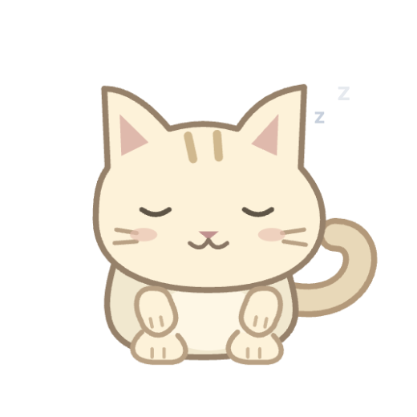
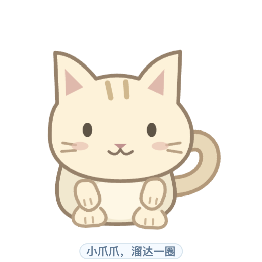

## 0.5.2 完整启动视频与赛博老爸 VI 标识（历史记录）

本轮按用户新要求将短开屏改为完整原片：从第 0 秒开始，正常播放只在真实 `ended` 后退场。原生初始化仍并行，提前就绪不会结束片头。保留明确点击跳过与 Esc；普通编辑键不会误结束片头，也不会传给被遮住的输入框造成改写或发送。系统 Meta/Ctrl 快捷键保留，Tab 可定位跳过按钮。

| 检查 | 本次实际结果 |
| --- | --- |
| 原生完整冷启动 | 正常 Cmd+Q 退出后启动原生应用；调试接入时视频处于 0.440247 秒，持续采样 197 帧到末帧 7.0 秒，真实 endedTime=7.081995 秒；结束后约 182.5ms 清除装饰并出现真实编辑器。不是以页面就绪时间代替视频结束 |
| 原生完整回归 | `./run.sh test:whalegirl-native` 通过：首个采样可见帧 0.066667 秒，真实结束 7.081995 秒，约 182.5ms 后释放；原生主题、同一输入框及草稿、菜单、工具箱、完整预览和美化开关保持正常 |
| 启动分支 | 5 个原有分支通过；最终 `./run.sh test:video-startup` 19 个视频场景通过。覆盖从头播完、提前就绪、加载延迟、原生协议、播放完仍未就绪、显式跳过、隐藏恢复、错误与超时，六条完整路径约 211 帧 |
| 键盘与资源 | 普通输入/Enter 不改变底层草稿或发送；Tab/Enter 可明确操作跳过，Esc 有效，退出后正常输入恢复。Blob 全部撤销，未完成请求中止，src 清除并停止解码 |
| 卡住保护 | 人为暂停的测试媒体约 15.20 秒退场，不伪造 ended；正常 7.08 秒原片不碰此上限。加载失败、原生错误、减少动态仍按各自回退路径处理 |
| 构建与单元 | 构建通过，54/54 单元测试通过；新 logo 纳入既有精确白名单媒体路由。无新增依赖，本轮没有重复干净安装 |

新 logo 由用户提供的 VI 通过内置 image_gen 生成，1254×1254 RGBA；页头显示为 48×48px 的透明正面半身像。保留圆头、黑色圆框眼镜、蓝色耳机、白西装和黑领带；旧机器人桌宠继续保留。实际原生小尺寸显示截图在下方，详细来源、提示词与替换方法见 [品牌标识](品牌标识.md)。

本轮没有改变用户的三项选择、180px 桌宠尺寸或位置，没有发送模型请求，也没有改签名安装包。仅验证当前 macOS Apple Silicon 与既有固定上游版本；其他系统沿用未验证状态。

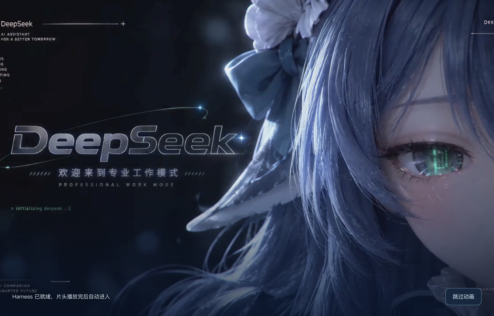


## 0.5.1 启动画面可见性修复（历史记录）

用户反馈实际打开时看不到视频。复查发现两处问题：原有装饰会随 BootPage 很快移除；原生 `dsh-app` 媒体转发省略长度后，实际 `seekable` 为 `0..0`，尝试跳到 2.2 秒仍从黑场播放。旧测试的“已挂载、已解码、已清理”不足以证明用户看到了有效动画。

本次让视频使用独立装饰层、同源本地 Blob 与有效首帧校验。视频可见且已播放到目标片段后保留 1.8 秒，随后淡出 180 毫秒；真实初始化继续并行，用户随时可跳过。媒体故障、原生失败、长时间加载和页面离开均有退出与释放路径。没有更改签名应用、模型接入或聊天逻辑。

| 检查 | 本次实际结果 |
| --- | --- |
| 完整原生冷启动 | 正常 Cmd+Q 退出后启动已安装的原生应用；在 `dsh-app://app/` 捕获实际播放的 1280×720 视频，`currentTime=2.60631`、文档可见、视频未暂停、图层不透明度约 0.97；随后装饰卸载并进入真实编辑器。截图如下 |
| 原生首帧与持续时间 | `./run.sh test:whalegirl-native` 通过；首个验证帧媒体时间 2.233333 秒，实际可见后约 1916.5ms 清理，视频 Blob 创建和回收一一对应 |
| 启动分支回归 | `./run.sh test:startup` 通过：5 个既有 SVG/自定义图片分支、16 个视频场景。覆盖快速就绪、先就绪后解码、原生流无法 seek、跳过、初始化失败、离开、404、禁播、慢请求、减少动态、可见性变化、延迟 Blob 和硬时限 |
| 不泄漏媒体 | 验证暂停、清除 src、停止解码、撤销 Blob URL、取消仍在进行的请求；尚未载入视频时恢复窗口不会误判播放失败；缺失视频不会产生 1ms 轮询忙循环 |
| 原生功能回归 | 同一个原生输入框与草稿在鲸鱼娘/森林切换后保留；菜单、工具箱、完整视频解码预览及美化总开关通过。未发送模型请求或重跑 AI 任务 |
| 构建与单元测试 | `./run.sh build` 成功；`./run.sh test` 54/54 通过。未新增依赖；从干净目录安装的记录沿用下方 0.5.0，本轮未重复下载依赖 |
| 用户设置 | 保留本轮开始时的三项鲸鱼娘选择、180px 桌宠尺寸和位置；没有恢复默认或重装原生客户端 |

macOS 的红色关闭按钮只隐藏窗口，再点 Dock 是恢复旧窗口，按设计不重播。要看完整启动流程，请在任务结束后 **Cmd+Q 完全退出 → 重新打开**。本轮只验证 macOS Apple Silicon；其他系统与历史待测项没有因此变为已验证。

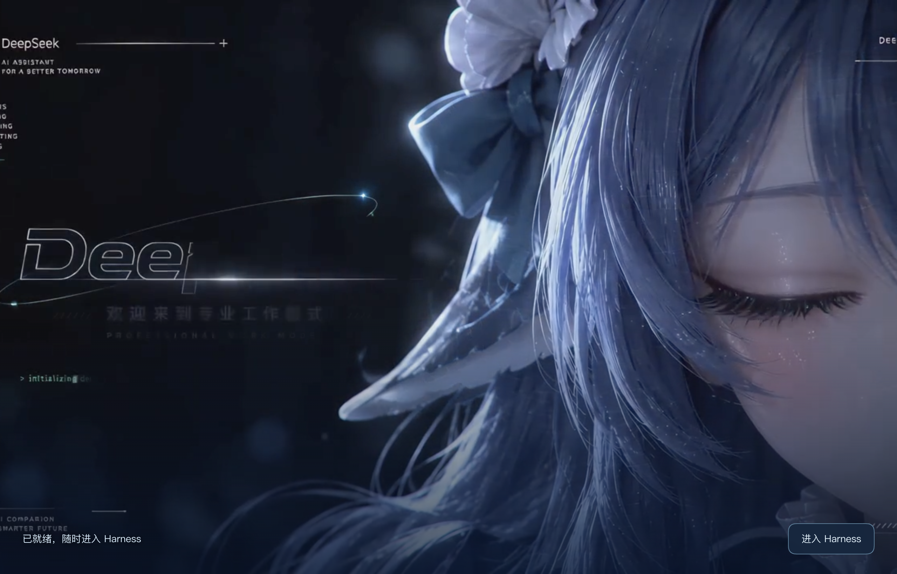
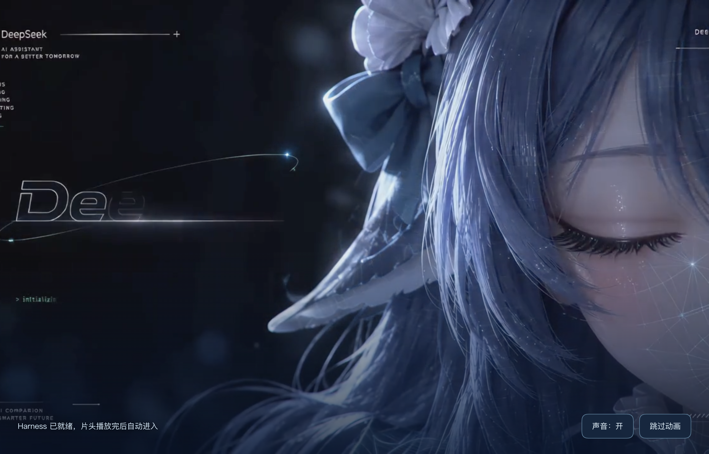

## 0.5.0 鲸鱼娘主题与互动（历史记录）

本次使用用户提供的 MP4、界面参考图和角色图，加入原生插件的第一项预设。原有预设保留，三个模块可继续混搭。本机选中三项鲸鱼娘，桌宠保留原有 100px 尺寸和位置。

| 检查 | 实际结果 |
| --- | --- |
| 全部单元测试 | `./run.sh test`：54/54 通过，包含默认回退、独立设置、素材路由、行为、音效与并发状态 |
| 完整构建 | `./run.sh build` 通过；大 PNG/MP4 保持独立本地文件，未写入 JS Base64 |
| 干净源码安装 | 142 个公开文件复制到全新目录；使用 Node 24.19.0、本机 npm 与官方 Electron 缓存完整执行 `./run.sh setup`，新安装 21 包、Electron 二进制和构建成功；该目录 54/54 测试通过。未复制本机设置，不重复修改原生 profile |
| 干净目录独立运行 | 实际 `./run.sh pet` 启动退出码 0，产生该目录专属桌宠与渲染进程，无 Harness 后端；仅对该进程正常 SIGTERM，229ms 内退出，PID 文件自动移除，无该目录进程残留 |
| 真实原生启动 | 完全退出后启动官方应用，在 `dsh-app://app/` 观察到 MP4 与原生 spinner 同时存在，视频实际解码；准备完成后装饰清理并出现真实编辑器，未添加等待时长 |
| 原生皮肤 | `./run.sh test:whalegirl-native` 通过。背景、侧栏、真实输入框、原生菜单和设置页可见；深蓝令牌、壁纸 URL 和输入框渐变实际生效。发布版与源码的槽位差异已按真实 DOM 修正 |
| 草稿与开关 | 鲸鱼娘↔森林切换保留同一个输入框节点与草稿；关闭美化移除鲸鱼娘背景，重新开启恢复；没有发送模型请求。本轮未重复进行运行中 AI 任务和真实代码块验收，历史测试保留如下 |
| 视频分支 | `./run.sh test:startup` 通过：ready、skip、failure、pagehide、video-error、off、reduced-motion，另含原有 SVG 与自定义图片分支。跳过保留加载状态，失败露出原生错误，视频释放断言覆盖 pause/remove src/load |
| 真实视频预览 | 原生工具箱解码 1280×720、约 7.082 秒视频，保持静音；可拖动进度预览，关闭即卸载。404/解码错误显示错误提示并释放源 |
| 媒体路由 | 精确白名单、不接受文件路径；MP4/PNG MIME、GET/HEAD、Range 206、无效范围 416、未知 ID 404 通过 |
| 鲸鱼娘真实窗口 | `./run.sh test:whalegirl-pet` 通过：真实菜单→preload→八种姿态，左右爬行、翻面回位，当前帧 alpha 命中、暂停/恢复、点击唤醒、拖拽与位置持久化 |
| 点击声音 | 真实可信点击链路调用音效，静音、拖动、菜单和自动入睡不产生声音节点；`./run.sh test:pet-sound-browser` 使用真实 OfflineAudioContext 验证峰值 0.031773、240ms 后零输出。未进行人工音箱试听 |
| 原有功能 | `./run.sh test:pet`、`test:custom-pet-store`、`test:custom-manager` 通过：尺寸实时变化、窗口不重建、自定义导入/删除回退、受控透明命中、正常退出无残留 |

新增互动是八张姿态图配合 CSS 呼吸、摇摆和位移，不能等同完整逐帧角色动画。自动化鼠标事件通过调试通道送入隔离 Electron 窗口；跨应用物理点击穿透、焦点不抢占、显示器热插拔，以及其他操作系统仍未实测。本轮没有修改签名应用、聊天、模型配置或任务逻辑。

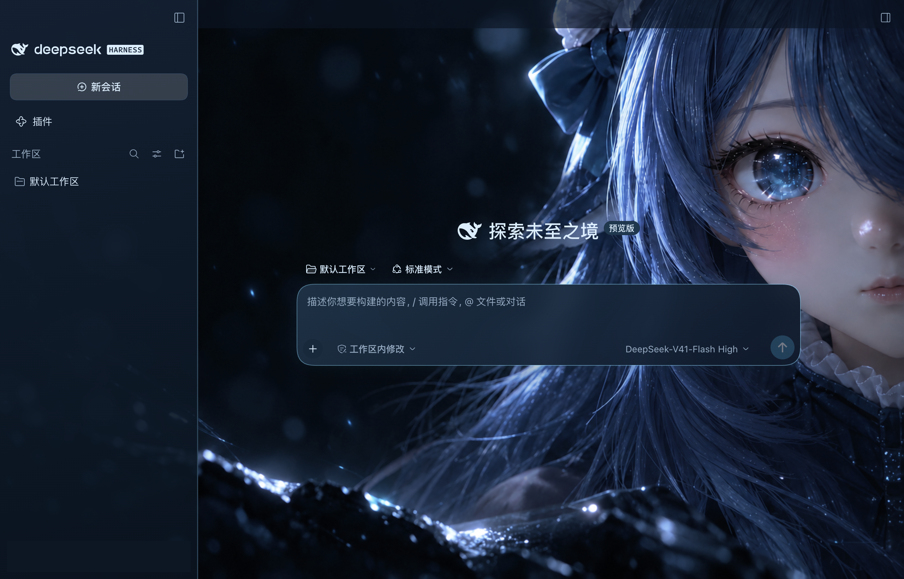
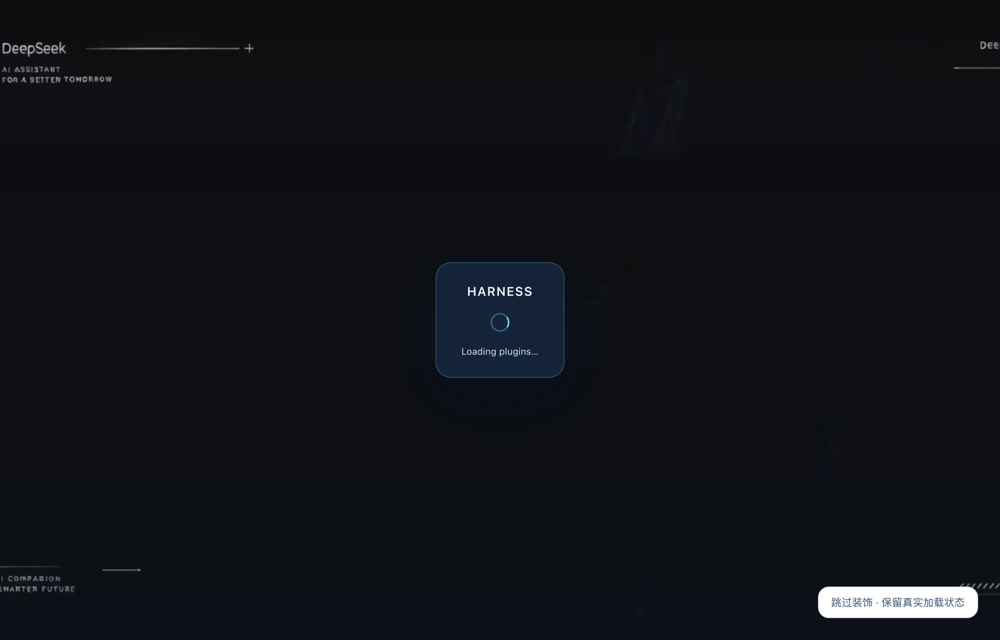
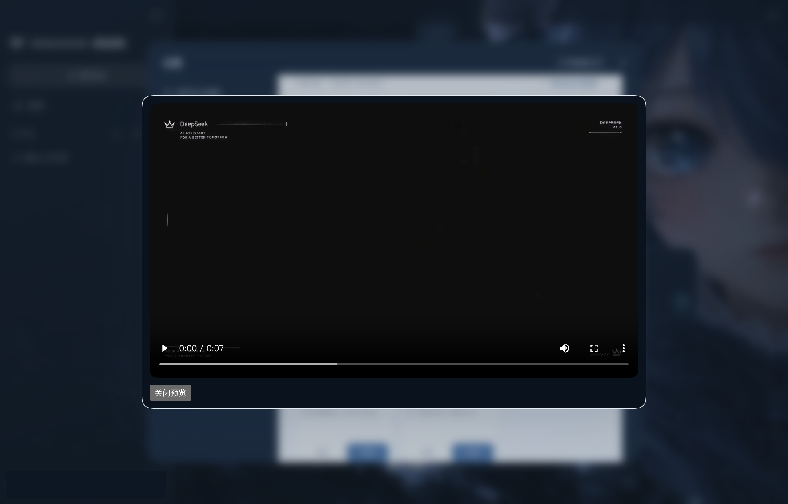


## 0.4.1 原地走动与可爱小动作

新增原地来回迈步、转身回位，以及扭扭舞、害羞探头和抖抖身体。走动只改变透明窗口内的图形，不移动系统窗口、不保存动画偏移。启动后 6–9 秒先走一圈，此后每隔 10–16 秒交替散步与小动作；自动动作不刷新睡眠计时。菜单增加「散散步」，暂停时禁用。

Browser 插件未提供，沿用已安装的 Playwright/Electron。流程为实际 `desktop/pet.html` 窗口 → 自动或菜单散步 → 可见左右位移和翻面 → 点击/拖拽接管 → 暂停/恢复 → 进入睡眠。所有自动化使用隔离数据目录；没有重启 Harness 后端。

| 检查 | 结果 |
| --- | --- |
| 单元测试 | `./run.sh test`：44/44 通过，其中行为测试 20 项；新增首次散步、动作交替、暂停剩余时长、互动优先、自定义宠物、按时睡眠及快速点击打断 |
| 实际窗口 | `./run.sh test:pet-behavior` 通过；页面 URL 和标题正确，三种素材实际显示，无页面运行错误 |
| 位移与朝向 | 实际 CSS 根矩阵向左右移动并翻转，6 秒后回到原点和初始朝向；截图记录三种宠物的散步帧 |
| 设置与拖拽 | 原地走动不修改窗口坐标或设置文件；用户拖拽可接管，之后走动保留拖好的位置 |
| 暂停与睡眠 | 暂停同时冻结实际 CSS 动画和逻辑时间；点击接管、睡眠、唤醒、三连点、拖动落地及旧边界回归通过 |
| 自定义透明命中 | 使用左半有色、右半透明的非对称 PNG，沿左右转身多个阶段检查真实命中 IPC，图形与透明区域保持对齐 |
| 视觉边界 | 三种内置宠物与全幅不透明自定义方图共 976 个新动作阶段采样、195 个既有动作回归采样，在 180px 窗口内未发现裁切；字幕不随转身镜像，减少动态正常 |
| 原生菜单与退出 | `./run.sh test:pet` 通过；原生「散散步」回调通过真实 preload 传递，暂停禁用，临时动作不写设置；普通退出和无调试器退出均通过 |
| 管理页 | `./run.sh test:custom-manager` 通过；添加表单、导入导出、保存与删除回退保持正常 |
| 构建 | `./run.sh build` 成功；本次未新增依赖，0.4.0 的干净目录安装记录保留在下方 |

动画测试对渲染器时间作加速，并在几何检查、截图时采样实际 CSS 动画阶段；这些结果不替代下方尚未完成的跨应用物理点击、焦点与显示器验收。


## 0.4.0 桌宠互动验证

在实际 `desktop/pet.html` 的透明 Electron 窗口内测试，使用临时数据目录。Browser 插件未提供，本轮沿用仓库 Playwright/Electron 测试；长时间闲置用渲染器虚拟时钟加速，产品运行代码仍按实际时间计时。没有修改 Harness 的会话、模型或任务。

| 检查 | 结果 |
| --- | --- |
| 干净源码安装 | 0.4.0 的 113 个公开文件复制到全新目录，用 Node 24.19.0 和本机离线缓存重新安装 21 个依赖包，`./run.sh setup` 构建成功，38 项测试全部通过；未复制私有数据或重复安装原生插件 |
| 行为状态机 | 38 项单元测试通过，其中 14 项覆盖 45 秒困倦、120 秒睡眠、长时间睡眠、12–22 秒不重复小动作、点击/连点、暂停计时、换宠、拖动和取消 |
| 真实窗口睡眠与点击 | 实际闭眼层显示、Zzz、呼吸；一次点击进入醒来动作，三连点进入跳跃或转圈及星光；动作结束恢复待机 |
| 个性与自定义 | 机器人招手、鲸鱼摆鳍吐泡、猫咪伸腰/抬爪；导入的星星同样能打盹和点击唤醒。GIF/动画 WebP 睡眠用快照，整体呼吸继续 |
| 拖动边界 | 实际原生窗口位置与模型动作联动；拖动中不入睡、松手落地。先复现并修复“暂停中起拖后恢复仍是 idle”及“取消不足 5px 的移动导致位置偏移” |
| 菜单与暂停 | 真实原生菜单 → preload → 渲染器事件链路通过；只接受 play/nap/wake，暂停时禁用；暂停冻结闲置时间，恢复不补播积压动作 |
| 视觉与点击范围 | 装饰与短文字全部不接受鼠标事件；自定义图片经过根节点位移/旋转/缩放后仍使用逆矩阵进行像素命中；减少动态时取消动画，保留静态睡眠与反馈 |
| 资源与退出 | 无持续逐帧 JavaScript 计算；状态调度每 500ms 一次，暂停或页面隐藏停止调度，退出清理监听和计时器。真实退出与无调试器退出 smoke 均通过 |
| 原有功能回归 | 自定义图片存储、权限、损坏回退、拖动持久化、菜单切换和独立模式通过；启动页五个分支、管理页添加/导入/导出测试通过 |

新增渲染验证没有页面运行错误。独立视觉检查另覆盖 195 个内置动作边界采样，包含完整转圈；这些是受控窗口检查，**仍不能替代下方的跨应用物理点击、焦点与显示器验收**。

以下为实际独立桌宠窗口截图，透明背景：


操作与录屏步骤见 [桌宠互动](桌宠互动.md)。已有进程需从右键菜单退出后用 `./run.sh pet` 重开；隐藏宠物或关掉管理窗不会重新载入代码。

## 0.3.0 自定义内容验证

以下操作在原生 `dsh-app://app/` 内完成，只截取工具箱弹层；没有发送新的模型请求，也没有导出会话内容。

| 检查 | 结果 |
| --- | --- |
| 干净源码安装 | 只复制 105 个公开文件，不复制 node_modules、运行时或本机设置；使用 Node 24.19.0 和本机依赖缓存执行 `./run.sh setup`，新安装 21 包并构建成功，24 项测试全部通过；未重复修改原生 profile |
| 自定义皮肤 | 原生设置内调色、保存、应用成功；真实根主题变量改变，输入编辑器仍是同一节点，临时草稿保持 |
| 启动与桌宠导入 | 在两个原生添加窗口分别导入原创星星 SVG；保存后不自动应用，卡片预览与手动应用通过 |
| 原生图片路由 | 已注册素材返回 200 / image/svg+xml；路径越界、未知 ID 与删除后访问拒绝，不传送任意文件 |
| 原生启动加载 | 完全重启应用后，观测真实窗口加载：自定义星星与原生 spinner 同时存在，图片解码宽度 240，背景为设定颜色；编辑器就绪后装饰与资源引用清理 |
| 三项重启保留 | 完全退出并重新启动官方应用，三个自定义 ID 与实际主题均保持 |
| 删除回退 | 在原生卡片确认删除各自的当前选项，分别回到冰蓝、蓝鲸、机器人；测试结束恢复测试前美化设置，清理测试草稿与预设 |
| 图像安全与恢复 | 24 项单元测试通过：含格式/大小/尺寸、SVG 子集、软链接和目录越界、坏配置备份、缺图回退、并发保存与旧刷新响应不能覆盖新选择 |
| 管理组件 | 实际渲染测试通过：颜色与参考皮肤保存、主题 JSON 导入/导出、图片预览、无效文件提示、保存失败重试、删除回退、窄屏、Escape 只关闭添加弹层 |
| 自定义系统桌宠 | 临时真实 Store → 原生 IPC → 透明 Electron 窗口全链路通过；被动图片渲染、alpha/留白命中、指针拖动传入真实窗口并保存位置、暂停/恢复、删除回退、退出 0 且测试进程全部消失 |

桌宠自动化的鼠标事件由调试通道送入隔离窗口，**不能代替下方待完成的跨应用物理点击验收**。GIF/动画 WebP 的点击范围使用载入帧，暂停显示快照，恢复不保证从同一帧续播。

本版本原生主进程会缓存本次启动的注入表。更换启动预设后需要**完全退出并重新启动**查看新的真实启动效果；标签中的预览即时更新。仅刷新旧窗口不是冷启动验证。

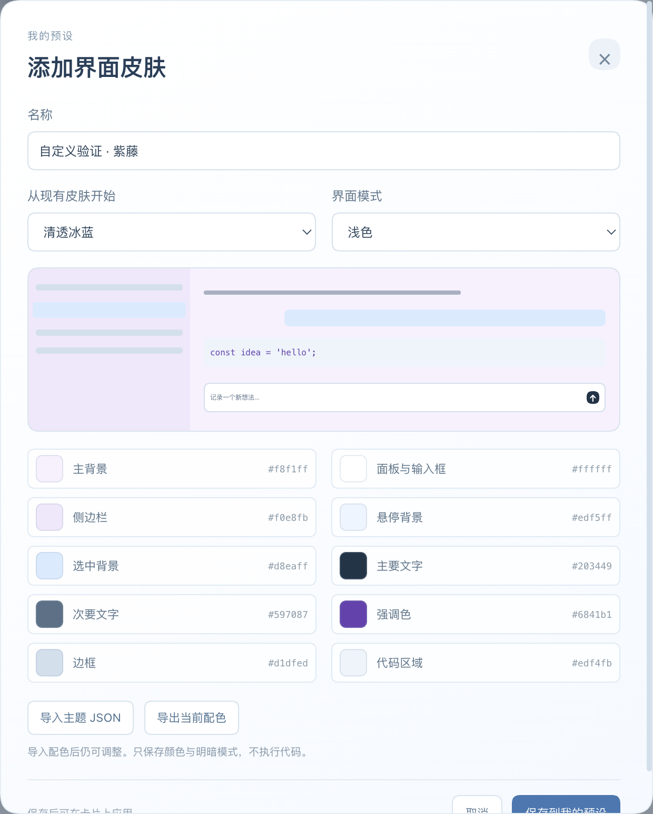
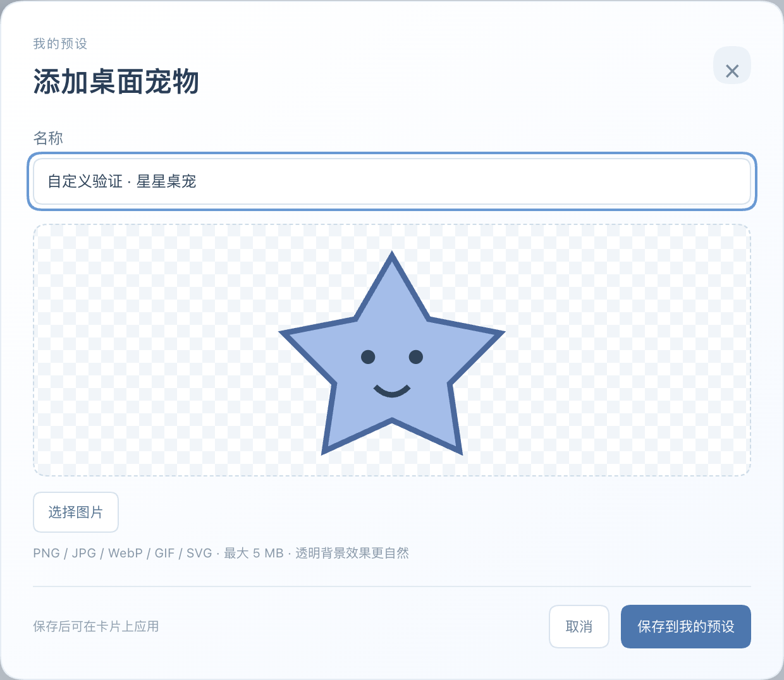


## 通过的检查

| 检查 | 本次证据与结果 |
| --- | --- |
| 源码安装 | `./run.sh setup` 实际成功；另在只复制公开源码的干净目录执行安装、构建和 7 项单元测试，通过。无需克隆完整上游 |
| 安装到原生应用 | 官方 `runPluginCommand` 成功安装本地 link 包，原生 profile 启用该插件；`codesign --verify --deep --strict` 校验仍通过 |
| 真实窗口 | 调试验证只连接 `dsh-app://app/`，窗口主进程是官方 `.app`，美化入口位于原生设置内 |
| 三套真实皮肤 | 实测原生聊天、会话列表、输入框、菜单、设置弹窗、代码容器和展开的终端工具调用界面；截图见下 |
| 实际代码颜色 | 冰蓝代码容器 `rgb(237,244,251)`，夜航 `rgb(24,34,57)`，森林 `rgb(237,241,228)`；原代码文本逐次一致 |
| 输入保持 | 换肤前后编辑器是同一个 DOM 节点，输入测试草稿原文相同；测试清理自己的草稿 |
| 运行中任务 | 原生 AI 执行 `sleep 8; printf "HARNESS_NATIVE_THEME_OK\n"`。通过原生设置切换夜航皮肤时“停止生成”仍存在；随后任务正常完成，实际工具输出见截图 |
| 原生启动装饰 | 在真实原生页面完整加载时记录到 BootPage → 装饰与 spinner 同时存在 → 工作界面；一次实测装饰约在 106ms 出现、534ms 随就绪移除。无强制延时；截图来自真实加载，不是预览 |
| 启动状态分支 | 基于固定版本 BootPage DOM 的测试覆盖完成、跳过、失败、关闭四个分支；跳过保留 spinner，失败移除装饰并保留错误文字。故障分支是夹具测试，未破坏用户真实配置来制造启动失败 |
| 独立组合 | 星河启动 + 森林主题 + 奶油猫分别选择并保存，完全结束并重新启动原生应用后配置逐项相同，真实编辑器就绪且森林主题已应用 |
| 跨窗口同步 | 工具箱关闭时，修改共享美化配置，原生主题仍同步；不重载聊天页 |
| 恢复与关闭 | 原生管理页关闭美化恢复官方色彩，重新开启有效；点击恢复默认后主题冰蓝、启动蓝鲸、宠物隐藏，真实会话代码仍在 |
| 受保护的本地 API | 原生 `/api/cyberdaddy` 使用已有鉴权与协议转发；不带认证的直连 HTTP 请求返回 401 |
| 桌宠独立运行 | 单独 Electron 入口创建透明宠物窗口，不创建聊天窗口，不启动 Harness 子进程；三种 SVG 均显示 |
| 桌宠原生属性 | 原生窗口 `alwaysOnTop=true`、`focusable=false`；这证明配置与读回值，不替代跨应用物理交互测试 |
| 桌宠拖动通道 | 渲染进程的受限 drag IPC 修改原生窗口位置，持久化坐标；取消指针事件正常 |
| 桌宠退出 | 经真实退出 IPC，普通无调试器 smoke 与 Playwright 测试均 exit 0。修复了 closed 回调访问已销毁窗口导致退出挂起的问题 |
| 配置可靠性 | 7 项单元测试覆盖损坏配置备份、无效预设回退、未来版本保留、并发写入、崩溃锁恢复、负坐标/移除显示器边界和可选桌宠缺依赖 |

原生验证会话名为“**Harness 原生插件验证**”，保留两条明确的测试请求与回答，便于用户复核；没有把会话数据库或账号配置收入源码包。实际模型测试沿用原生已有配置，并产生了原生模型用量；美化自身不调用模型。截图中的账号入口已遮盖。

## 尚未完成的实机验收

**10 月 4 日验证期间 Mac 锁屏；10 月 5 日补测时，桌面控制在连接透明宠物窗口时出现异常长时间等待，未完成物理点击验证。以下项目不能声称通过：**

- 最终版鼠标真实拖动、拖拽后的位置恢复，以及与其他普通应用叠放时的点击反馈。
- 透明角落点击是否穿透到底层应用、连续点击与右键菜单关闭后的穿透行为。
- 输入其他应用时是否始终不抢键盘焦点、原生 Harness 最小化后的实机交互。
- 真实显示器拔插、不同缩放、多 Space 与全屏切换。

锁屏前已通过系统操作显示真实宠物窗口并打开其右键菜单。后来修正了拖拽实现，因此最终版不能沿用此前观察来宣称拖拽通过。自动化的窗口属性、IPC 和位置测试也不能替代上述操作。

Windows、Linux、Intel Mac 及其他 Harness 版本未验证。

## 可复现测试

```sh
./run.sh setup
./run.sh test                     # 45 项单元测试
./run.sh test:install-browser     # 首次需要 Chromium 测试运行时
./run.sh test:startup             # 4 个状态分支 + 自定义图片
./run.sh test:custom-manager      # 添加表单、导入导出与保存行为
./run.sh test:pet                 # 隔离设置的真实 Electron 窗口与退出
./run.sh test:pet-behavior        # 实际桌宠的走动、转身命中、睡眠、唤醒、暂停和拖动
./run.sh test:custom-pet-store    # 真实素材存储与桌宠 IPC 全链路
```

原生 UI 测试只在无任务执行的测试会话运行。先完全退出原生应用，启动带临时本地调试端口的官方可执行文件：

```sh
'/Applications/DeepSeek Harness.app/Contents/MacOS/DeepSeek Harness' \
  --remote-debugging-address=127.0.0.1 --remote-debugging-port=9224
# 在另一终端，项目目录中：
./run.sh test:native
```

测试会话必须已有一条真实代码块回复。此脚本会切换美化选项、输入临时草稿并清理自己的草稿、截取当前测试会话；请勿在私人会话运行。它不会自动发送模型请求。验证后正常退出调试实例，再使用 `./run.sh start` 日常启动。

新增自定义验证无需历史消息：在上述本地调试实例中执行 `./run.sh test:native-custom`，然后 Cmd+Q 完全退出，用同一调试命令重新打开，依次执行 `./run.sh test:native-custom-startup` 和 `./run.sh test:native-custom --cleanup`。前一步创建三项临时预设，后一步检查重启保留并在管理页删除，恢复原设置。若中途失败，执行 `./run.sh test:native-custom --recover` 只清理本次记录的测试内容。检查点位于 `.local/custom-native-qa.json`，不得提交。

更改并构建插件文件后，应完整退出和重新打开原生 Harness。开发时只刷新旧进程曾触发原生插件导入错误；完整重启后恢复正常。不要将热更新作为本版本支持的开发流程。

## 原生运行截图

真实加载页（仅插件加载阶段；主进程更早的启动仍由官方负责）：

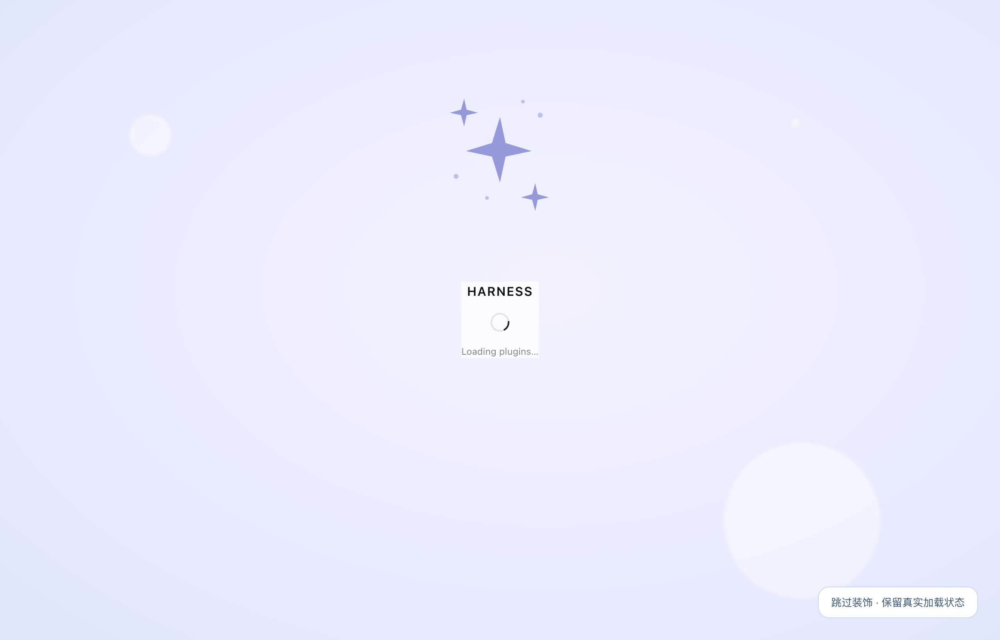

原生设置里的工具箱：

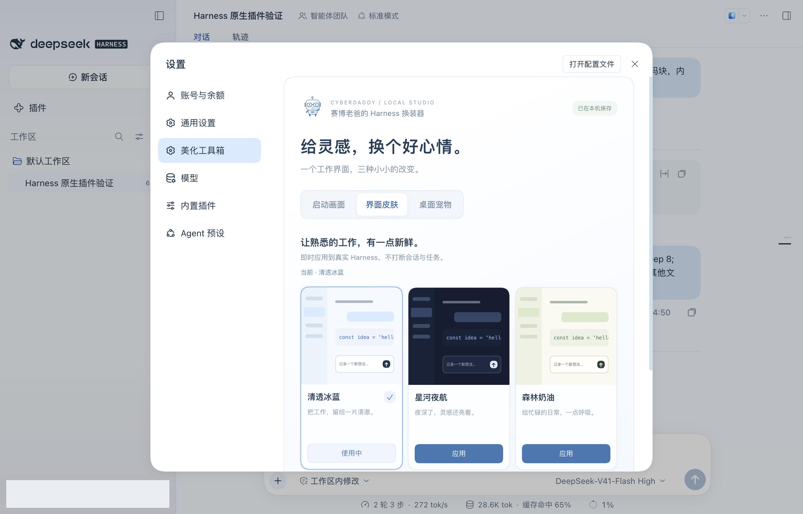

真实聊天、代码和菜单：

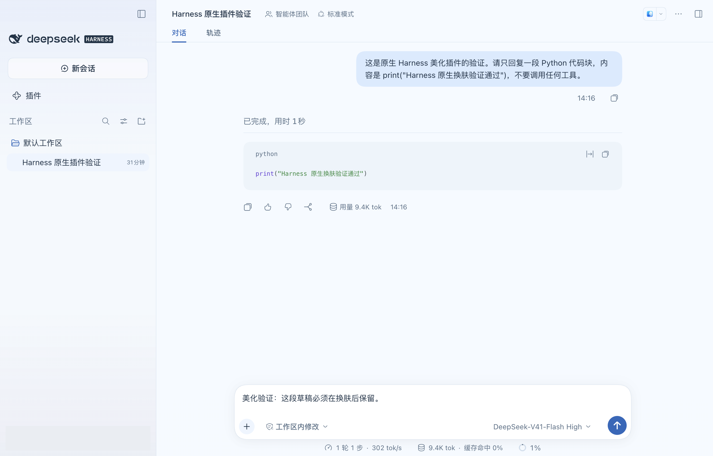
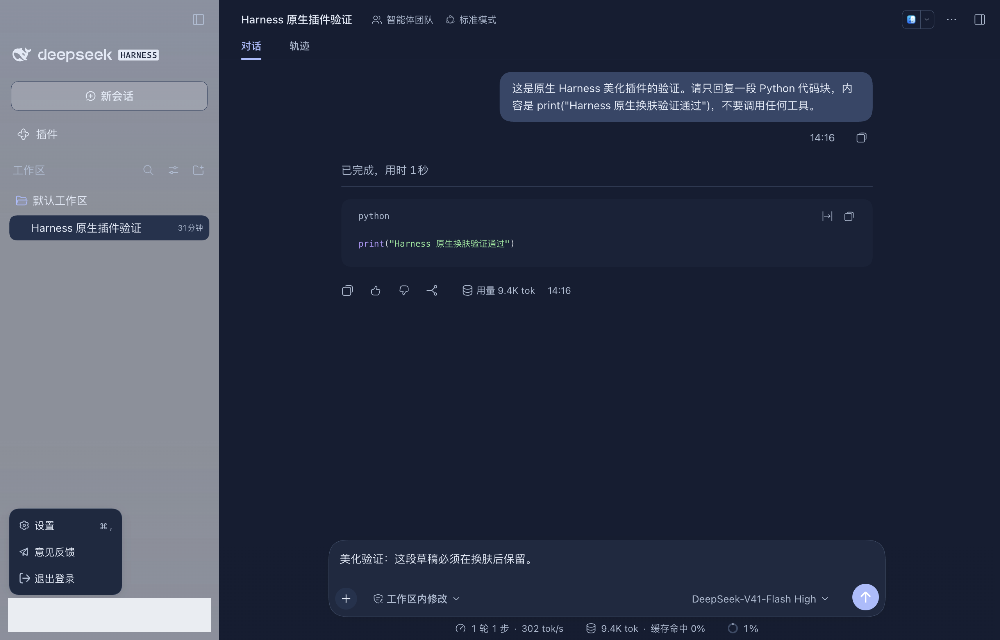
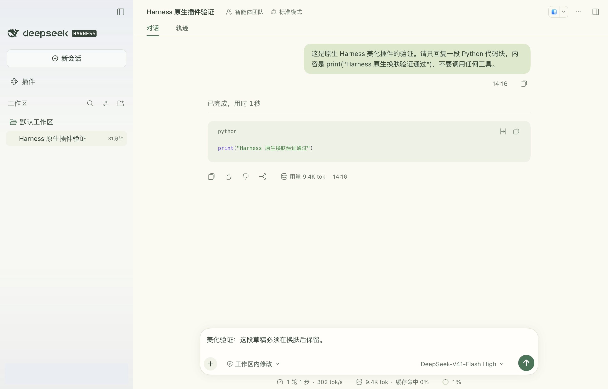

真实运行结束后的工具调用：

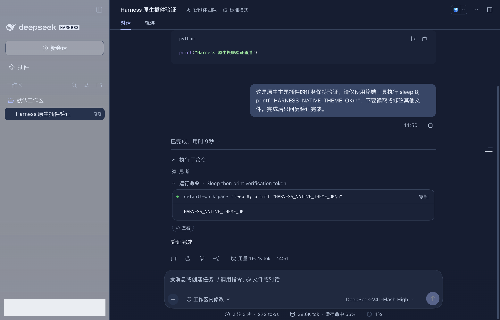

独立原生宠物窗口的内容截图（透明背景，**不证明跨应用点击穿透**）：


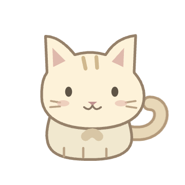

## 解锁后的手动步骤

1. `./run.sh pet`，测试三种宠物、缩放、点击、拖拽、右键暂停/继续及退出；重开确认位置。
2. 在项目目录执行 `python3 -m http.server 3189 --bind 127.0.0.1 --directory tests`，普通浏览器打开 `http://127.0.0.1:3189/manual-pet.html`。
3. 把宠物拖到页面上方。点身体时底层计数不增加；点同一透明窗口的空白角落时计数增加；重复拖动后与菜单关闭后再检查。
4. 在底层输入框连续输入，操作宠物后检查输入焦点；最小化 Harness，确认宠物继续存在。记录真实系统叠放截图。
5. 隐藏宠物后使用菜单栏 `◉` 重新显示，再选择退出，确认伴随进程停止。关闭桌宠管理窗只关闭管理窗。

## v0.4.2：更容易调整桌宠大小

本次将新安装的默认尺寸调整为 120 px，增加 **右键 → 桌宠大小** 的五个常用档位，并保留管理页的精细调节。已有本地尺寸不会被默认值覆盖；本机当前桌宠已调整为 100 px。

| 已完成检查 | 结果与边界 |
| --- | --- |
| 单元测试 | `./run.sh test`，45/45 通过，包含尺寸下限与默认值检查 |
| 原生窗口即时缩放 | 真实 Electron 窗口依次切换 80、100、120 px，读回窗口宽高与选择一致；沿用同一个渲染页面，无需重载或重新启动 |
| 本地保存 | 调整后的大小写入本地美化设置，80 px 不再被旧下限回退为 100 px |
| 原生大小菜单 | 80、100、120、180、240 px 档位与当前大小对应；110 px 这类非预设值不会误选 80 px |
| 管理页精细调节 | `test:pet` 从原生菜单「管理页精细调节」打开真实 `manager.html`；滑块 Home 到 80 px，再点加号到 90、100 px，同一个桌宠窗口同步缩放并保存 |
| 滑块体验与构建 | `test:custom-manager` 通过，105 px 旧设置显示一致，滑块在连续操作、慢保存与轮询时保持焦点；原有素材功能回归通过。`./run.sh build` 成功 |
| 现有进程更新 | 本机旧桌宠已完整退出并重新打开，新进程使用 100 px；曾临时切到 80 px 并等待后检查仍为 80 px，再恢复 100 px |

管理页当前范围是 80–320 px：滑块逐像素细调，加减按钮每次 10 px。卡片前即可看到大小控制。

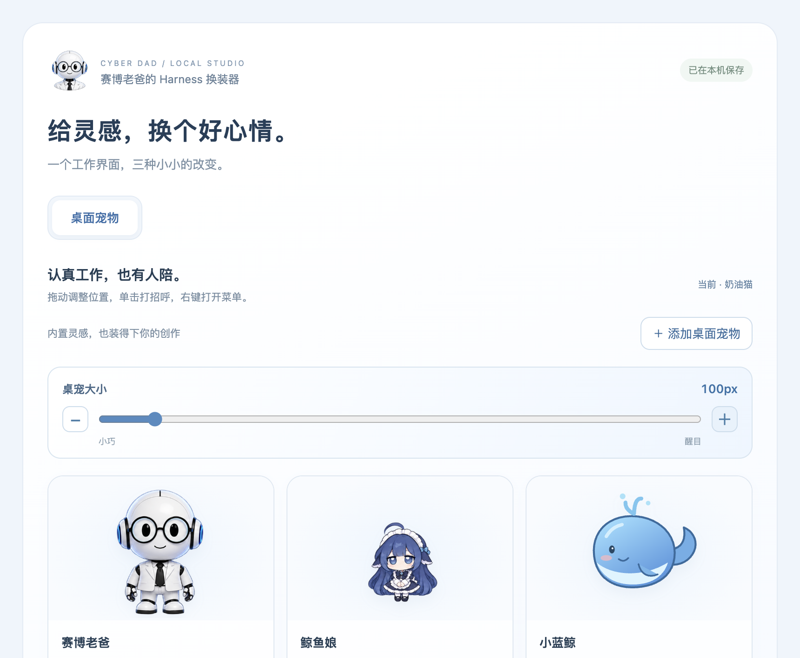

这些是尺寸存储、原生窗口属性和自动化操作的证据，不代表跨应用物理点击穿透、鼠标拖动或键盘焦点已经完成实机验收。
