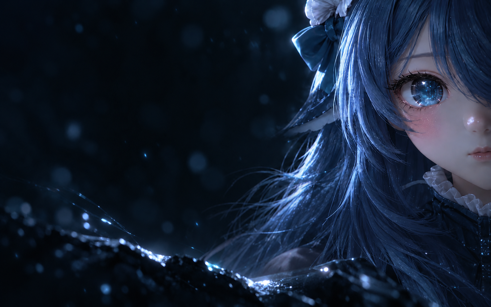
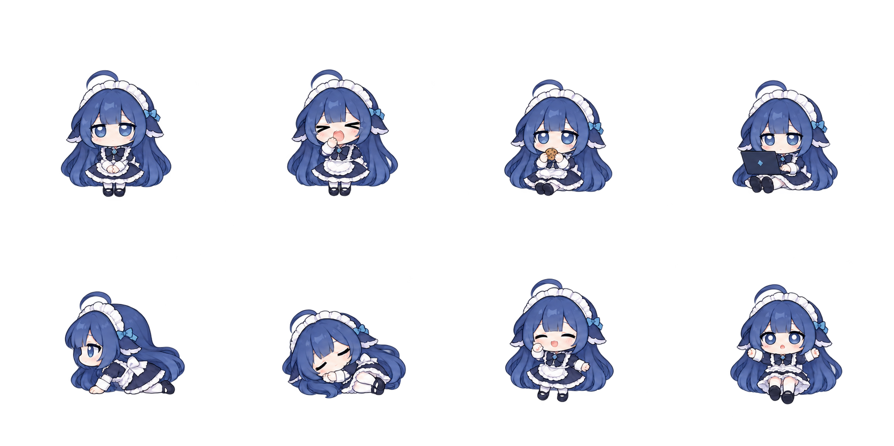

# 鲸鱼娘：启动、皮肤与桌宠

v0.5.0 将鲸鱼娘设为三个分类的默认选项；v0.5.2 按用户要求改为完整播放后进入工作界面。原有三套启动画面与皮肤保留；v0.5.3 移除小机器人桌宠，优化奶油猫的双前爪。仍可混搭，例如鲸鱼娘启动视频、森林奶油皮肤、奶油猫桌宠。新默认值不会清空已有设置或导入库。

在原生 **左下角账号菜单 → 设置 → 美化工具箱** 中，分别选择三个标签的鲸鱼娘卡片并点击「应用」。「恢复默认」会一起恢复默认选项，但保留自定义素材库；桌宠显示与否仍由开关控制。

## 原声启动视频

使用本地 MP4，1280×720、H.264 视频与 AAC-LC 声音，约 7.082 秒。v0.7.2 保留原 720p 视频数据包，不重编码、不改变画面或启动时长；将静音音轨替换为用户新提供的同内容 4K 视频中的声音，降低 6 dB 并做短淡入淡出。**实际启动与管理页预览都从第 0 秒播放，包括开头较暗的渐入。**

旧 774,720 字节 MP4 虽然带有音轨，解码后却全是静音；v0.7.1 开启播放器声音无法修复素材本身。旧原片与新原音轨均保存在 `assets/sources/`，可复现处理步骤见 [鲸鱼娘启动音轨](鲸鱼娘启动音轨.md)。日常运行不需要 FFmpeg，也没有额外音频播放器。

视频层独立于原生加载页。真实初始化照常并行，主界面提前就绪不会截断动画；只有视频自然播放结束后，才淡出 180 毫秒进入主界面。若此时 Harness 还未就绪，继续显示官方加载状态。启动和预览默认播放新素材的声音，遵循系统输出音量。启动层可开关声音，仅对本次播放有效；预览可通过视频控件静音或调节音量，自动播放被阻止时点击视频播放按钮开始播放。实际启动不循环播放；隐藏窗口时音视频一起暂停，恢复可见后继续。

- 点击右下角跳过图标或按 Esc 可主动跳过；普通按键和单独的修饰键不会误结束视频。
- 初始化失败时立即移除装饰，让原生错误与恢复入口保持可见。
- 实际启动时有声自动播放被环境策略拒绝，会先静音继续视频，用静音图标表示可点击开启声音，并向读屏提供限制原因，不显示额外文字提示；静音播放也失败才回退海报。视频缺失或解码失败同样回退海报，原生就绪后进入。媒体首帧有 2.2 秒可见时间的解码宽限。
- 正常播放设有 15 秒可见时间故障上限，仅用于卡住的媒体；不会截断约 7.08 秒的正常原片。静态海报最多保留 4.5 秒；之后显示真实界面或加载状态。
- 系统启用「减少动态效果」时使用海报，不请求播放视频；原生就绪后进入。
- 完成、跳过或离开页面后立即停止声音，暂停并卸载视频源，终止请求和解码，回收 Blob URL。

v0.8.2 的启动层右下角使用两个 30 px 圆角小按钮与 16 px SVG：左侧扬声器／静音图标，右侧跳过图标。按钮不常显文字，保留读屏名称、声音按下状态与 Tab／Enter 操作；Esc 仍可直接跳过。左下角不再重复显示「已就绪／初始化」文案，也不再叠加整片底部遮罩。真正的原生错误，以及结束或跳过后尚未就绪时的加载提示继续保留。SVG 和自定义图片启动页同样使用小跳过图标。本次没有修改视频、音轨，管理页视频预览继续使用原生控件。

**macOS 关闭窗口只是隐藏，不等于退出程序。**再次点击 Dock 或执行 `./run.sh start` 只恢复原窗口，不重播启动画面。选择新启动预设后，先保存工作并等待正在执行的任务完成，再用 Cmd+Q 正常完全退出，执行 `./run.sh start` 查看实际启动。无需重启的演示使用管理页「预览」。当前支持的视频是随项目登记的内置素材，普通自定义导入仍只接收图片。

## 深蓝霓虹真实皮肤

壁纸由用户的参考图编辑而来，去掉图内界面、文字、边框等，保留右侧角色和安静的深蓝背景。聊天、侧边栏、输入框、代码、菜单和设置继续使用 Harness 的真实组件，由主题令牌与受控样式改变外观。换肤不重启后端，也不清空输入。

下图是背景素材预览，不是另一套聊天界面：

## 八姿势桌宠

透明 PNG 图集包含四列两行、八个姿势：

| 第一行 | 第二行 |
| --- | --- |
| 待机 | 爬行 |
| 打哈欠 | 睡觉 |
| 吃零食 | 开心点击反馈 |
| 陪伴工作 | 被提起拖动 |

渲染器按行为选择一格，再配合 CSS 爬行、转身、摇摆和呼吸。**这是八种姿势加运动效果，不是完整逐帧骨骼或角色动画。**

快速演示用 **右键 → 陪陪鲸鱼娘 → 喂一口 / 陪我工作 / 打个哈欠**。右键「散散步」可立即开始爬行，「打个盹」「叫醒」用于睡眠切换。

真实单击时播放本地合成轻音；右键取消「点击音效」或在工具箱中关闭即可静音。自动爬行、待机和菜单操作不主动发声，无需音频 API 或网络。音效开关、尺寸与位置都保存在本地。

现有 100 px 尺寸可继续使用；**右键 → 桌宠大小** 可选常用档位，管理页滑块提供 80–320 px 细调。普通自定义图片仍使用整体动作，不会自动生成八种姿势。详细操作见 [桌宠互动](桌宠互动.md)。

## 本地资源和来源

- `assets/whalegirl-startup.mp4`：运行用视频；画面直接复制原 720p H.264，声音来自用户新提供的 `大家的反响很高，单独出一个视频_#deepseek设定_#治_4k.MP4`，处理后封装为 AAC-LC。
- `assets/sources/whalegirl-startup-silent.mp4`：原 `DeepSeek动态壁纸_deepseek_harness__720p.MP4`，保留原始 774,720 字节。
- `assets/sources/whalegirl-startup-audio.m4a`：从新 4K 文件仅提取原 HE-AACv2 音轨，保留原压缩数据；用于素材维护，不由播放器单独加载。
- `assets/whalegirl-wallpaper.png`：按用户的 `深蓝霓虹深空 AI 工作台.png` 参考，通过内置图像生成工具编辑，1586×992 RGB。
- `assets/whalegirl-atlas.png`：按用户的 `IMG_8963.jpg` 角色参考，通过同一工具编辑为八姿势透明图集，1774×887 RGBA。

完整提示词与编辑记录见 [鲸鱼娘素材生成](鲸鱼娘素材生成.md)。MP4 和 PNG 保持独立文件，不作为大段 Base64 塞进客户端脚本。美化运行不需要额外 API Key。

原始素材的作者和再分发授权尚未确认；用户提供参考图以及工具生成输出，不等于获得所有原始角色或图像权利。上述视频、音轨和图片**不自动适用本项目 MIT 许可证**。公开分发前应补全素材授权或替换为已获授权的素材；详见 [来源与第三方声明](../THIRD_PARTY_NOTICES.md)。

实际验证范围、截图和未完成项目以 [验证报告](验证报告.md) 为准。
